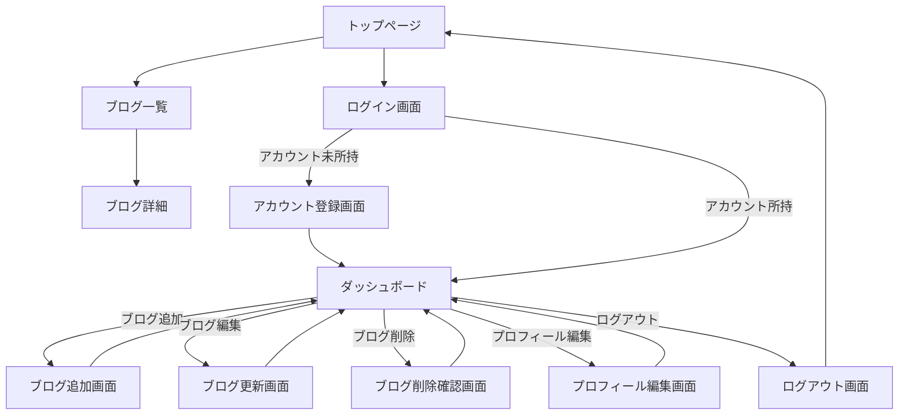

# 🚀 FullStackBlog

Next.js、Prisma、Tailwind CSS、Supabase を使って構築された、モダンで高機能なフルスタックブログアプリケーションです。

---

## 画面遷移図


## ✨ 主な機能

- 📝 **Markdown対応のブログ投稿**
- 🔒 **Supabaseによる認証機能**
- ⚡ **Next.js 15による超高速表示**
- 🎨 **Tailwind & MUIによる美しいUI**
- 💾 **Prisma ORM & PostgreSQL対応**
- 🚀 **TypeScript・ESLint・Prettier導入**
- 📦 **Redux Toolkitによる状態管理**
- 📱 **レスポンシブデザイン・モバイル対応**
- 🦾 **簡単なテーマカスタマイズ**

---

## 📁 プロジェクト構成

```
src/
  app/            # Next.jsアプリルーティング
  components/     # Reactコンポーネント
  css/            # グローバル＆モジュールスタイル（Tailwind）
  generated/      # 自動生成コード（例：Prismaクライアント）
  hooks/          # カスタムReactフック
  shard-theme/    # テーマ設定/共通テーマ
  store/          # Reduxストア設定
  utils/          # ユーティリティ関数
  middleware.ts   # Next.jsミドルウェア
  types.ts        # TypeScript型定義
```

[全てのソースツリーはこちら →](https://github.com/aren28/FullStackBlog/tree/main/src)

---

## 🚦 開発を始めるには

1. **リポジトリをクローン**

   ```bash
   git clone https://github.com/aren28/FullStackBlog.git
   cd FullStackBlog
   ```

2. **依存パッケージのインストール**

   ```bash
   npm install
   ```

3. **環境変数の設定**  
   `.env.example` を `.env` にコピーし、必要な値を入力してください。

4. **データベースマイグレーションの実行**

   ```bash
   npx prisma migrate dev
   ```

5. **開発用サーバーの起動**

   ```bash
   npm run dev
   ```

6. **[http://localhost:3000](http://localhost:3000) をブラウザで開く**

---

## 🛠️ 利用可能なスクリプト

- `npm run dev` - 開発サーバー起動
- `npm run build` - 本番ビルド
- `npm run start` - 本番サーバー起動
- `npm run lint` - ESLintでコードチェック
- `npm run format` - Prettierでコード整形
- `npm run check` - Lint & フォーマットチェック

---

## 🧩 技術スタック

- **フロントエンド:** Next.js 15, React 19, Tailwind CSS, MUI
- **バックエンド:** Prisma, Supabase
- **状態管理:** Redux Toolkit
- **型安全:** TypeScript
- **Lint/整形:** ESLint, Prettier

---

## 📄 ライセンス

MIT © [Padorina](https://github.com/aren28)

---

> _フォーク・コントリビュート大歓迎！自分だけのブログとしてぜひご活用ください！_
